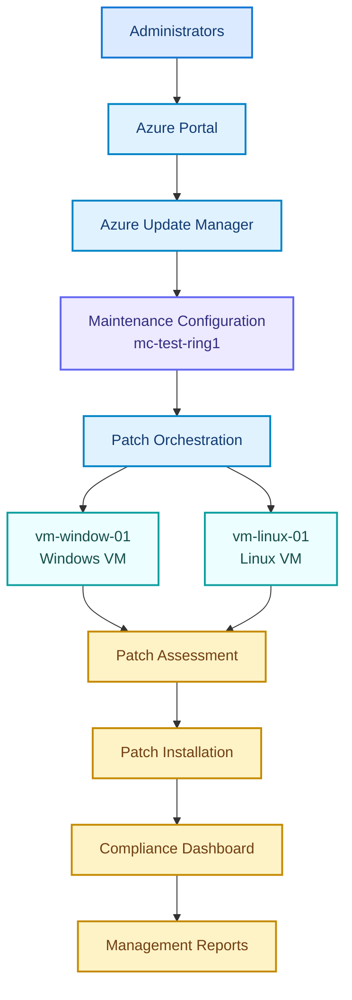

# Azure Patch Compliance

## Azure Update Manager Portal

[Open Azure Update Manager in the Azure Portal](https://portal.azure.com/#view/Microsoft_Azure_Automation/UpdateCenterMenuBlade/~/machines)

## Problem Statement

Organizations often manage Windows and Linux virtual machines across Azure subscriptions without a consistent, auditable patching process. Manual patching can result in missed security updates, inconsistent maintenance windows, and limited visibility into compliance status.

This project addresses that problem by designing an Azure-based patch compliance workflow that uses **Azure Update Manager**, **Maintenance Configurations**, and patch orchestration to assess and update virtual machines in a controlled and repeatable manner.

## Solution Overview

The solution enables administrators to:

- Register and manage Azure virtual machines from the Azure Portal.
- Group machines into controlled maintenance rings.
- Assess missing patches before installation.
- Orchestrate patch deployment for Windows and Linux virtual machines.
- Install approved security and critical updates during scheduled maintenance windows.
- Monitor patch compliance through dashboards.
- Produce management-ready compliance reports.

## Architecture

### Architecture Flow

1. **Administrators** initiate and manage patching activities.
2. **Azure Portal** provides the management interface for configuring and monitoring the environment.
3. **Azure Update Manager** centralizes update assessment and deployment across Azure machines.
4. **Maintenance Configuration (`mc-test-ring1`)** defines the maintenance schedule, scope, and patching behavior for the target machine group.
5. **Patch Orchestration** coordinates the deployment workflow.
6. **Windows VM (`vm-window-01`)** and **Linux VM (`vm-linux-01`)** receive assessment and patching operations.
7. **Patch Assessment** identifies missing, installed, and applicable updates.
8. **Patch Installation** deploys approved patches during the configured maintenance window.
9. **Compliance Dashboard** provides visibility into machine-level and environment-level compliance.
10. **Management Reports** summarize patch status and support governance, auditing, and operational decision-making.

## Components

| Component | Purpose |
| --- | --- |
| Azure Portal | Administrative interface for configuring and monitoring the solution. |
| Azure Update Manager | Assesses update status and manages patch deployment for Azure machines. |
| Maintenance Configuration | Defines the target machines, schedule, recurrence, and patching settings. |
| Patch Orchestration | Coordinates assessment and installation across the selected machines. |
| Windows VM | Demonstrates patch compliance management for a Windows workload. |
| Linux VM | Demonstrates patch compliance management for a Linux workload. |
| Patch Assessment | Determines which updates are applicable or missing. |
| Patch Installation | Installs approved updates according to the maintenance policy. |
| Compliance Dashboard | Displays patch status and compliance results. |
| Management Reports | Provides evidence and summaries for operational and management review. |

## Expected Benefits

- **Improved security:** Reduces exposure to known vulnerabilities by keeping machines updated.
- **Centralized management:** Provides one Azure-native workflow for Windows and Linux patching.
- **Controlled maintenance:** Uses maintenance rings and scheduled windows to reduce operational risk.
- **Better visibility:** Makes patch status and exceptions easier to identify.
- **Audit readiness:** Produces reports that can support compliance and governance reviews.
- **Reduced manual effort:** Replaces repetitive machine-by-machine patching tasks with orchestration.

## Implementation Workflow

1. Create or identify the target Windows and Linux virtual machines.
2. Enable the machines for management by Azure Update Manager.
3. Create the maintenance configuration named `mc-test-ring1`.
4. Assign the target machines to the maintenance configuration.
5. Run a patch assessment and review missing updates.
6. Configure and execute patch installation during the maintenance window.
7. Validate the installation results and investigate failures.
8. Review the compliance dashboard.
9. Generate management reports and retain them for audit or operational tracking.

## Repository Contents

This repository currently contains the project reference material:

- [`abstract ..pdf`](./abstract%20..pdf) — project abstract.
- [`azure 26-26 (3).pptx`](./azure%2026-26%20%283%29.pptx) — project presentation.
- [`tasks.docx`](./tasks.docx) — project tasks and related documentation.

## Prerequisites

- An active Azure subscription.
- Appropriate Azure permissions to manage virtual machines and Azure Update Manager.
- At least one Windows VM and one Linux VM for the demonstration environment.
- Network connectivity and supported VM agents/extensions.
- A defined maintenance schedule and patching policy.

## Security and Operational Considerations

- Use least-privilege role assignments for administrators and automation identities.
- Test updates in a non-production or pilot maintenance ring before broad deployment.
- Define maintenance windows that align with business and recovery requirements.
- Review patch failures and excluded updates rather than treating them as compliant.
- Maintain backups or recovery procedures appropriate to the workload before patch installation.
- Regularly review compliance exceptions and update the maintenance configuration as the environment changes.

## Conclusion

The Azure Patch Compliance solution provides a structured and repeatable approach to assessing, installing, and reporting patches across Windows and Linux virtual machines. By combining Azure Update Manager, maintenance configurations, patch orchestration, and compliance reporting, organizations can improve security, operational visibility, and audit readiness.
